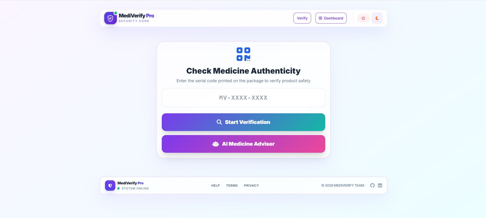
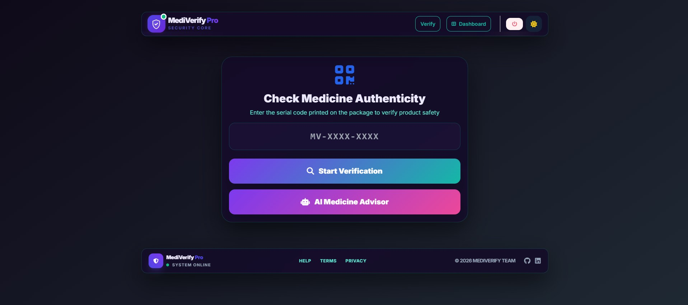

# 🛡️ MediVerify Pro
### **Advanced Medicine Authenticity & Inventory Management System**

**MediVerify Pro** is a professional Full-Stack solution (MERN Architecture) designed to combat counterfeit medicine. It empowers medical administrators to manage pharmaceutical inventory and generate unique, secure serial numbers, while providing a public portal for consumers to instantly verify product authenticity and safety status.

---

## 📸 Project Showcases

| Dark Mode Interface | Light Mode Interface |
| :---: | :---: |
|  |  |
| *Premium Glassmorphism Design* | *Clean & Professional UI* |

---

## ✨ Core Features

### 👤 Administrative Portal (Protected)
- **Secure Access:** Robust login/registration system using **JWT** (JSON Web Tokens) and **Bcryptjs** for password hashing.
- **Inventory Control (CRUD):** Full management of medicine records (Create, Read, Update, Delete).
- **Smart Serial Generation:** Utilizes **Nanoid** and **Crypto** to generate high-entropy, unique identifiers (e.g., MV-A1B2C3).
- **Live Search:** Instant client-side filtering to navigate through large medicine databases efficiently.

### 🔍 Consumer Verification Engine
- **Instant Check:** Consumers can verify product serial numbers without an account.
- **Double-Safety Logic:** The system checks if the serial exists AND validates the **Expiry Date** to warn against outdated products.
- **Dynamic Alerts:** High-end interactive notifications using **SweetAlert2** (Success for Authentic, Error for Fake, Warning for Expired).

### 🤖 AI Health Advisor *(New)*
- **Smart Suggestions:** One-click generation of random medicine entries via the AI Health Advisor button.
- **Auto Database Entry:** Generated medicines are instantly saved to the database with a unique serial number and expiry date.
- **Dashboard Integration:** The medicine table and stats counter refresh automatically after each AI suggestion.
- **Dual Entry Points:** The AI advisor button is available on both the Verify page and the Admin Dashboard.
- **Secure Architecture:** Anthropic API key is stored server-side in `.env` and never exposed to the frontend.

### 🎨 Visual Experience
- **Glassmorphism UI:** Modern translucent panels with backdrop blur effects.
- **Theme Persistence:** Automated Dark/Light mode based on user preference, saved in `localStorage`.

---

## 🛠️ Technical Stack

| Layer | Technologies Used |
| :--- | :--- |
| **Frontend** | HTML5, Tailwind CSS, JavaScript (ES6+), SweetAlert2, FontAwesome 6 |
| **Backend** | Node.js, Express.js |
| **Database** | MongoDB (Mongoose ODM) |
| **Security** | JWT, Bcryptjs, CORS |
| **AI Integration** | Anthropic Claude API (claude-sonnet-4-20250514) |
| **Utilities** | Nanoid (ID Generation), Dotenv, Crypto |

---

## 📁 Project Structure

```text
├── config/
│   └── db.js                # MongoDB Connection configuration
├── middleware/
│   └── authMiddleware.js     # JWT Verification & Route protection
├── models/
│   ├── Medicine.js          # Mongoose Schema for medicine records
│   └── User.js              # Mongoose Schema for admin users
├── public/
│   ├── index.html           # Main SPA entry point
│   ├── script.js            # Frontend logic & API integration
│   └── style.css            # Custom CSS & Glassmorphism styling
├── routes/
│   ├── authRoutes.js        # Authentication API endpoints
│   ├── medicineRoutes.js    # Medicine CRUD & Verification endpoints
│   └── aiRoutes.js          # AI Health Advisor endpoint (New)
├── utils/
│   └── errorResponse.js     # Custom Error Handling class
├── .env                     # Environment variables (Private)
├── .gitignore               # Files to be excluded from Git
├── app.js                   # Server entry point & Middleware setup
├── package.json             # Project dependencies & Scripts
├── package-lock.json        # Locked dependency versions
└── README.md                # Project documentation
```

---

## ⚙️ Installation & Deployment

### Clone the repository:
```bash
git clone https://github.com/MomenElsayedDev/MediVerify-Pro.git
cd MediVerify-Pro
```

### Install dependencies:
```bash
npm install
```

### Environment Setup:
Create a `.env` file in the root directory:
```dotenv
PORT=3001
MONGODB_URI=your_mongodb_connection_string
JWT_SECRET=your_super_secret_key
ANTHROPIC_API_KEY=your_anthropic_api_key
```

### Launch the system:
```bash
# Development mode (with Nodemon)
npm run dev

# Production mode
npm start
```

---

## 🔌 API Endpoints

### Auth Routes — `/api/auth`

| Method | Endpoint    | Description          | Auth |
|--------|-------------|----------------------|------|
| POST   | `/register` | Create admin account | ❌   |
| POST   | `/login`    | Login and get token  | ❌   |

### Medicine Routes — `/api/medicines`

| Method | Endpoint          | Description             | Auth |
|--------|-------------------|-------------------------|------|
| GET    | `/all`            | Get all medicines       | ❌   |
| GET    | `/verify/:serial` | Verify by serial number | ❌   |
| GET    | `/:id`            | Get medicine by ID      | ❌   |
| POST   | `/add`            | Add new medicine        | ✅   |
| PUT    | `/update/:id`     | Update medicine details | ✅   |
| DELETE | `/delete/:id`     | Delete a medicine       | ✅   |

### AI Routes — `/api/ai` *(New)*

| Method | Endpoint   | Description                                | Auth |
|--------|------------|--------------------------------------------|------|
| POST   | `/suggest` | Generate & save a random AI medicine entry | ❌   |

---

## 🔒 Reliability & Performance

🟠 **CORS Enabled:** Cross-Origin Resource Sharing configured for secure frontend-backend communication.

🟢 **Centralized Error Handling:** Standardized API responses for every possible error scenario using a custom `ErrorResponse` class.

🟠 **Efficient ID Generation:** Using **Crypto** for collision-resistant serial numbers in the format `MV-XXXXXX`.

🟢 **Secure API Keys:** The Anthropic API key is stored server-side in `.env` and never exposed to the frontend.

---

## 👨‍💻 Developed By

**Momen Elsayed**
- GitHub: [@MomenElsayedDev](https://github.com/MomenElsayedDev)
- LinkedIn: [momen-elsayed-dev](https://www.linkedin.com/in/momen-elsayed-dev/)